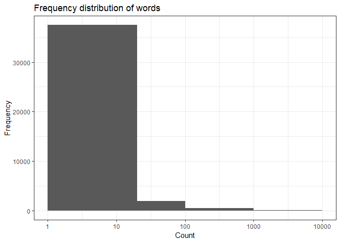
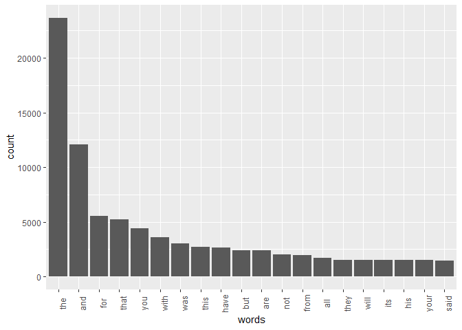
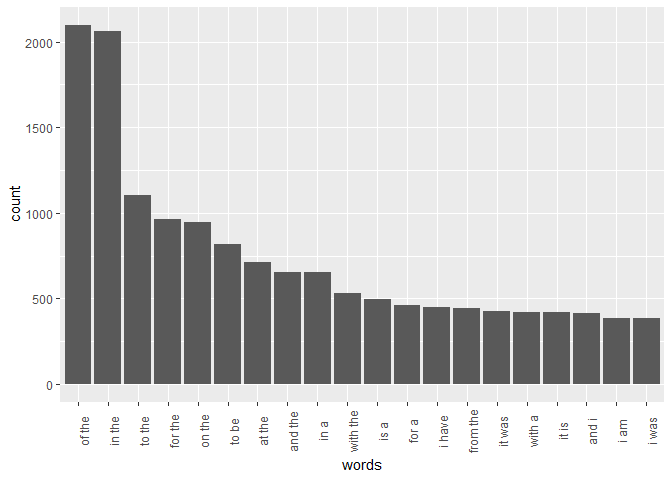
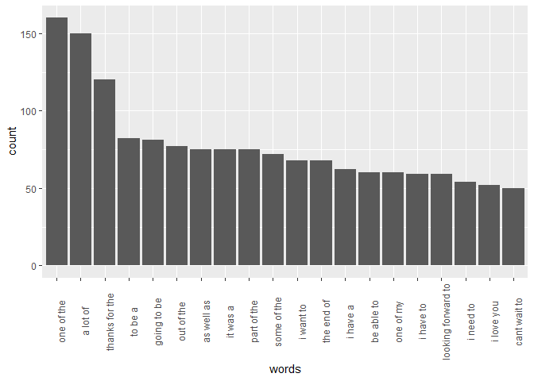

# Milestone Report

In this report we take a look at some of the observations derived from the `en_US` dataset.

## Exporatory data analysis

We start by looking at the raw, unprocessed data.

### File stats


```r
files = c('blogs.txt','news.txt','twitter.txt')
wordCount = c(37334117,34365936,30373559)
lineCount = c(899288,1010242,2360148)
size = c('201MB','197MB','160MB')
df = data.frame(file=files,wordCount=wordCount,lineCount=lineCount,size=size)
library(knitr)
```

```
## Warning: package 'knitr' was built under R version 3.5.1
```

```r
kable(df, caption = 'Basic stats')
```


Table: Basic stats

file           wordCount   lineCount  size  
------------  ----------  ----------  ------
blogs.txt       37334117      899288  201MB 
news.txt        34365936     1010242  197MB 
twitter.txt     30373559     2360148  160MB 

### Sampling

Loading the entire files in memory and performing analysis would be difficult, so instead we'll focus on a 0.5% sample. This will allow us to iterate through our assumptions faster and create an analysis pipeline - which can then be performed again for either a different sample or one of a larger size.


```r
set.seed(20180101)

sampleFile <- function(fileName, newFileName, threshold) {
  con <- file(description = fileName, open = 'rb') # we read the file in binary so we ignore control characters like C-z
  file.create(newFileName)
  newFileCon <- file(description = newFileName, open = 'w')
  linesRead <- 0
  totalLines <- 0
  while (length(line <- readLines(con, n = 1, warn = FALSE, skipNul = TRUE)) > 0) {
    if (runif(1) < threshold) {
      linesRead <- linesRead + 1
      writeLines(line, con = newFileCon)
    }
    totalLines <- totalLines + 1
  }
  close(newFileCon)
  close(con)  
  print(paste('read',linesRead,'out of',totalLines,'lines from',fileName,'into',newFileName))
}

threshold = 0.005 #0.5%

sampleAll <- function () {
  
  s <- function(f_in) {
    f_out = sub('.txt','.sample.txt',f_in)
    sampleFile(f_in, f_out, threshold)
  }
  
  s('en_US.blogs.txt')
  s('en_US.news.txt')
  s('en_US.twitter.txt')
}
```

### Corpus, vocabluary size and distribution

We create a Corpus as below - we are not interested in case nor in punctunation - and leverage `iconv` to only keep ASCII charaters:


```r
library('tm')
```

```
## Warning: package 'tm' was built under R version 3.5.1
```

```
## Loading required package: NLP
```

```
## Warning: package 'NLP' was built under R version 3.5.1
```

```r
src <- DirSource(directory="c:/shared/datasciencecoursera/capstone/en_US", pattern="*sample.txt")
docs <- VCorpus(src)
docs <- tm_map(docs, content_transformer(function(x) iconv(x, to='ASCII//TRANSLIT')))
docs <- tm_map(docs, content_transformer(tolower))
docs <- tm_map(docs, content_transformer(removePunctuation))
docs <- tm_map(docs, content_transformer(stripWhitespace))
docs <- tm_map(docs, content_transformer(removeNumbers))

tdm <- TermDocumentMatrix(docs)
```

Using the sample, we see we have 6168 unique entires:


```r
m <- as.matrix(tdm)
dim(m)
```

```
## [1] 39871     3
```

However if we try to plot a histogram, we see that we have many values with very few occurrences, 


```r
library(ggplot2)
```

```
## Warning: package 'ggplot2' was built under R version 3.5.1
```

```
## 
## Attaching package: 'ggplot2'
```

```
## The following object is masked from 'package:NLP':
## 
##     annotate
```

```r
v <- sort(rowSums(m),decreasing=TRUE)
p <- ggplot(data=data.frame(counts=v), aes(counts)) + stat_bin(breaks=c(1,20,100,1000,10000)) + 
      scale_x_log10() +
      labs(x='Count', y='Frequency', title='Frequency distribution of words') +
      theme_bw()
print(p)
```

<!-- -->

Though some words clearly dominate the frequency count:


```r
h <- head(v, 20)
h
```

```
##   the   and   for  that   you  with   was  this  have   but   are   not 
## 23675 12087  5521  5208  4422  3564  3015  2726  2660  2392  2371  2003 
##  from   all  they  will   its   his  your  said 
##  1927  1685  1542  1540  1529  1515  1501  1481
```
But we clearly see diminshing returns:


```r
df <- data.frame(count=h, words=names(h))
df$words <- factor(df$words, levels=df$words) # to force the ordering as we have it
p <- ggplot(df, aes(x=words,y=count)) + geom_bar(stat='identity') + theme(axis.text.x=element_text(angle=90))
print(p)
```

<!-- -->

### N-grams

We also want to understand what kind of words come in pairs and in triplets. This will be very useful to suggest what word might come after something like 'Monday to ...'.


```r
NgramTokenizer <- function(x, n) {
    unlist(lapply(ngrams(words(x), n), paste, collapse = " "), use.names = FALSE) }

BigramTokenizer <- function(x) {NgramTokenizer(x, 2)}
TrigramTokenizer <- function(x) {NgramTokenizer(x, 3)}

tdm_bi <- TermDocumentMatrix(docs, control = list(tokenize = BigramTokenizer))
tdm_tri <- TermDocumentMatrix(docs, control = list(tokenize = TrigramTokenizer))
```

We define a function to the plotting:


```r
plotTop20 <- function(tdm) {
  m <- as.matrix(tdm)
  v <- sort(rowSums(m),decreasing=TRUE)
  h <- head(v, 20)
  df <- data.frame(count=h, words=names(h))
  df$words <- factor(df$words, levels=df$words) # to force the ordering as we have it
  p <- ggplot(df, aes(x=words,y=count)) + geom_bar(stat='identity') + theme(axis.text.x=element_text(angle=90))
  print(p)
}
```

Let's plot a frequency graph of the top 20 bi-grams:


```r
plotTop20(tdm_bi)
```

<!-- -->

And similarly for tri-grams:


```r
plotTop20(tdm_tri)
```

<!-- -->

## Conclusion and moving forward

English stop-words like 'the' make up the vast majority of the words in our dataset. This is only mildly useful - but looking at n-grams provides us with a better view of how words related to one another. We will be leveraging those features (i.e. context-awareness) when building our predictive text input. 
