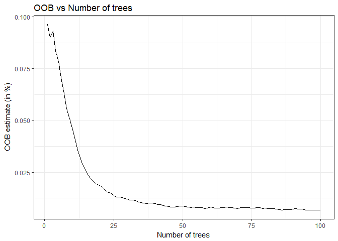

## Overview

The aim of this project is, given a set of measurements, to decide whether an individual is doing the Unilateral Dumbbell Bicep curle exercise correctly and if not, what might need to be rectified.

The data was provided from: <http://web.archive.org/web/20161224072740/http:/groupware.les.inf.puc-rio.br/har>

Quoting from the above, "Six young health participants were asked to perform one set of 10 repetitions of the Unilateral Dumbbell Biceps Curl in five different fashions: exactly according to the specification (Class A), throwing the elbows to the front (Class B), lifting the dumbbell only halfway (Class C), lowering the dumbbell only halfway (Class D) and throwing the hips to the front (Class E).". Our goal is therefore to decide which class a particular movement falls in.

## Setup

This report was produced using the `knitr` package. We provide the below for reproducibility:


```r
sessionInfo()
```

```
## R version 3.5.0 (2018-04-23)
## Platform: i386-w64-mingw32/i386 (32-bit)
## Running under: Windows 10 x64 (build 17134)
## 
## Matrix products: default
## 
## locale:
## [1] LC_COLLATE=English_Singapore.1252  LC_CTYPE=English_Singapore.1252   
## [3] LC_MONETARY=English_Singapore.1252 LC_NUMERIC=C                      
## [5] LC_TIME=English_Singapore.1252    
## 
## attached base packages:
## [1] stats     graphics  grDevices utils     datasets  methods   base     
## 
## other attached packages:
## [1] randomForest_4.6-14 caret_6.0-80        e1071_1.7-0        
## [4] Hmisc_4.1-1         ggplot2_2.2.1       Formula_1.2-3      
## [7] survival_2.41-3     lattice_0.20-35     dplyr_0.7.5        
## 
## loaded via a namespace (and not attached):
##  [1] Rcpp_0.12.17        ddalpha_1.3.4       DRR_0.0.3          
##  [4] bindr_0.1.1         knitr_1.20          magrittr_1.5       
##  [7] cluster_2.0.7-1     MASS_7.3-49         magic_1.5-9        
## [10] sfsmisc_1.1-2       splines_3.5.0       tidyselect_0.2.4   
## [13] colorspace_1.3-2    R6_2.2.2            rlang_0.2.1        
## [16] foreach_1.4.4       geometry_0.3-6      broom_0.5.0        
## [19] latticeExtra_0.6-28 withr_2.1.2         gower_0.1.2        
## [22] iterators_1.0.10    htmltools_0.3.6     class_7.3-14       
## [25] recipes_0.1.3       CVST_0.2-2          assertthat_0.2.0   
## [28] abind_1.4-5         rprojroot_1.3-2     digest_0.6.15      
## [31] tibble_1.4.2        Matrix_1.2-14       acepack_1.4.1      
## [34] rmarkdown_1.10      compiler_3.5.0      DEoptimR_1.0-8     
## [37] pillar_1.2.3        pls_2.7-0           scales_0.5.0       
## [40] backports_1.1.2     stats4_3.5.0        lubridate_1.7.4    
## [43] pkgconfig_2.0.1     rstudioapi_0.7      munsell_0.5.0      
## [46] RcppRoll_0.3.0      prodlim_2018.04.18  plyr_1.8.4         
## [49] stringr_1.3.1       tools_3.5.0         ipred_0.9-7        
## [52] grid_3.5.0          nnet_7.3-12         dimRed_0.1.0       
## [55] nlme_3.1-137        htmlTable_1.12      timeDate_3043.102  
## [58] data.table_1.11.4   gtable_0.2.0        checkmate_1.8.5    
## [61] lazyeval_0.2.1      yaml_2.1.19         bindrcpp_0.2.2     
## [64] lava_1.6.3          gridExtra_2.3       kernlab_0.9-27     
## [67] purrr_0.2.5         tidyr_0.8.1         reshape2_1.4.3     
## [70] RColorBrewer_1.1-2  ModelMetrics_1.2.0  codetools_0.2-15   
## [73] htmlwidgets_1.2     base64enc_0.1-3     rpart_4.1-13       
## [76] glue_1.2.0          evaluate_0.11       robustbase_0.93-3  
## [79] stringi_1.1.7       foreign_0.8-70
```

## Exploratory Data Analysis & Features Reduction

Let's take a look at the data:


```r
#training <- read.csv('pml-training.csv', na.strings = c('NA','#DIV/0!'))
training <- read.table('pml-training.csv', na.strings = c("NA","#DIV/0!"), sep=",", stringsAsFactors = F, header=T)
print(dim(training))
```

```
## [1] 19622   160
```

```r
head(colnames(training),n=20)
```

```
##  [1] "X"                    "user_name"            "raw_timestamp_part_1"
##  [4] "raw_timestamp_part_2" "cvtd_timestamp"       "new_window"          
##  [7] "num_window"           "roll_belt"            "pitch_belt"          
## [10] "yaw_belt"             "total_accel_belt"     "kurtosis_roll_belt"  
## [13] "kurtosis_picth_belt"  "kurtosis_yaw_belt"    "skewness_roll_belt"  
## [16] "skewness_roll_belt.1" "skewness_yaw_belt"    "max_roll_belt"       
## [19] "max_picth_belt"       "max_yaw_belt"
```

The first 7 variables are more booking-keeping related than actual measurements from the sensors, though the time component could be import but we'll ignore it for now. The last variabe, `classe`, is the one we're looking to predict.

We notice that a number of variables are primarily NA.


```r
# first 7 columns are user-related, the last one is the class we're looking to predict
tr <- training[, seq(8,160)]
num_na <- lapply(tr, function(c) { sum(is.na(c))})
print(sum(num_na > 19200))
```

```
## [1] 100
```

```r
clean_tr <- tr %>% select(-which( num_na > 19200))
print(dim(clean_tr))
```

```
## [1] 19622    53
```

Excluding variables that are over 98% NA, we end up with 53. This is still quite high so let's see which ones are highly correlated.


```r
corrM <- rcorr(as.matrix(clean_tr[,-53]))
m <- as.matrix(corrM$r)
diag(m) <- 0 # as each variable is perfectly correlated with itself
which(m > 0.90 | m < -0.90, arr.ind = T)
```

```
##                  row col
## total_accel_belt   4   1
## accel_belt_y       9   1
## accel_belt_z      10   1
## accel_belt_x       8   2
## roll_belt          1   4
## accel_belt_y       9   4
## accel_belt_z      10   4
## pitch_belt         2   8
## roll_belt          1   9
## total_accel_belt   4   9
## accel_belt_z      10   9
## roll_belt          1  10
## total_accel_belt   4  10
## accel_belt_y       9  10
## gyros_arm_y       19  18
## gyros_arm_x       18  19
## gyros_dumbbell_z  33  31
## gyros_forearm_z   46  31
## gyros_dumbbell_x  31  33
## gyros_forearm_z   46  33
## gyros_dumbbell_x  31  46
## gyros_dumbbell_z  33  46
```

There are a number of variables that are very highly correlated (positively or negatively). We'll exclude the following column indexes: `c(4,9,10,8,19,33,46)`


```r
final_tr <- clean_tr[,-c(4,9,10,8,19,33,46)]
dim(final_tr)
```

```
## [1] 19622    46
```

## Model training

Now that we have a cleaner data set, let's build a couple of models but first, we separate our training set into 2, with 30% of the observations going into testing.


```r
set.seed(1778)
inTrain <- createDataPartition(y=final_tr$classe,
                              p=0.7, list=FALSE)
final_tr$classe <- as.factor(final_tr$classe)
tr <- final_tr[inTrain,]
te <- final_tr[-inTrain,]
```


```r
model_rpart <- train(classe~., data=tr, method="rpart")
p_rpart <- predict(model_rpart, te)
cm_rpart <- confusionMatrix(p_rpart, te$classe)
print(cm_rpart$overall['Accuracy'])
```

```
##  Accuracy 
## 0.4858114
```

```r
cm_rpart$table
```

```
##           Reference
## Prediction    A    B    C    D    E
##          A 1529  485  490  430  177
##          B   35  364   34  167  135
##          C  106  290  502  367  306
##          D    0    0    0    0    0
##          E    4    0    0    0  464
```

The `rpart` model (recursive partition) performed poorly, with an accuracy of only 49%.

Let's try using `svm` for Support Vector Machines.


```r
model_svm <- svm(classe~., data=tr)
#model_svm <- train(classe~., data=tr, method="svmRadial")
p_svm <- predict(model_svm, te)
cm_svm <- confusionMatrix(p_svm, te$classe)
print(cm_svm$overall['Accuracy'])
```

```
##  Accuracy 
## 0.9440952
```

```r
cm_svm$table
```

```
##           Reference
## Prediction    A    B    C    D    E
##          A 1661   83    1    0    0
##          B    6 1012   25    0    5
##          C    7   40  989   92   30
##          D    0    1   11  871   24
##          E    0    3    0    1 1023
```

We can see that Support Vector Machines did a great job at differentiating the classes, with an accuracy of 94%. But can we do better?


```r
# using caret's `train` with `method='rf'` takes too long for some reason
model_rf <- randomForest(classe ~ ., data=tr, importance=T, ntree=100)
p_rf <- predict(model_rf, te)
cm_rf <- confusionMatrix(p_rf, te$classe)
print(cm_rf$overall['Accuracy'])
```

```
##  Accuracy 
## 0.9957519
```

```r
cm_rf$table
```

```
##           Reference
## Prediction    A    B    C    D    E
##          A 1672    7    1    0    0
##          B    1 1131    1    0    0
##          C    0    1 1024   10    0
##          D    0    0    0  954    3
##          E    1    0    0    0 1079
```

The RandomForest gives us an accuracy of 99.5%, even higher than SVM. This means there is little point using model stacking and we can use this as our final model.

But was 100 trees sufficient? We can plot our out-of-bag (OOB) error rate:


```r
oob <- model_rf$err.rate[,1]
df <- data.frame(oob=oob, x=seq(1,length(oob)))
pl <- ggplot(df, aes(x=x,y=oob)) + geom_line() + 
      labs(x='Number of trees', y='OOB estimate (in %)', title='OOB vs Number of trees') +
      theme_bw()
print(pl)
```

<!-- -->

Our final OOB estimate for 100 trees is 0.64%.

We then classify our testing observations as below:


```r
testing <- read.table('pml-testing.csv', na.strings = c("NA","#DIV/0!"), sep=",", stringsAsFactors = F, header=T)
predict(model_rf, testing)
```

```
##  1  2  3  4  5  6  7  8  9 10 11 12 13 14 15 16 17 18 19 20 
##  B  A  B  A  A  E  D  B  A  A  B  C  B  A  E  E  A  B  B  B 
## Levels: A B C D E
```
